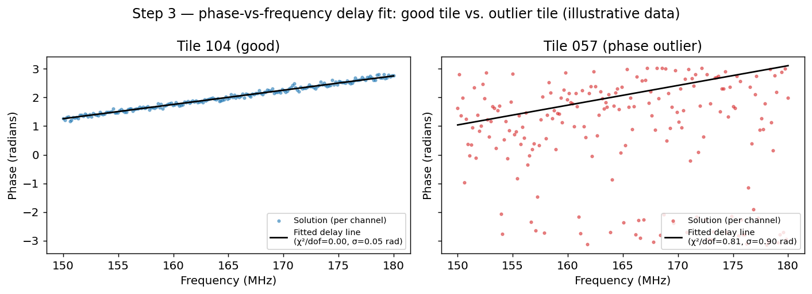
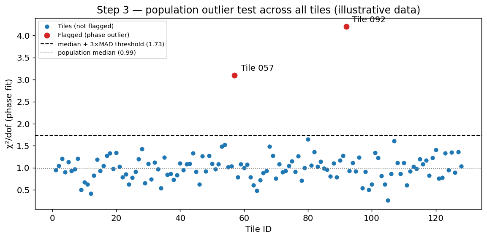
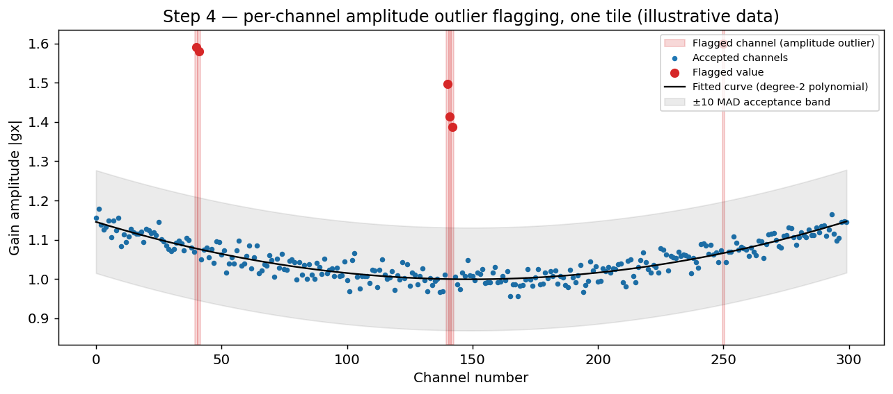

# Calvin: Calibration Solution Cleaning and Outlier Flagging

This document describes what happens to an MWA calibration solutions file (or set of files, for a multi-band/picket-fence observation) after `hyperdrive` has written it out, and before it is archived and made available to users. This stage is informally known as **Calvin**.

The goal of this stage is to catch calibration solutions that `hyperdrive` produced but that are not physically trustworthy — non-converged channels, tiles with broken cables or receivers, RFI-corrupted channels, etc. — and flag them so they are not used downstream, while leaving good solutions untouched.

Everything below applies per-observation. If an observation spans more than one contiguous frequency band (a "picket-fence" observation), each band's solutions file is processed together as a group, sharing a single reference antenna and a single set of tile-level decisions, but each file's amplitude fit is done independently (see [Step 4](#step-4-amplitude-outlier-flagging)).

## Contents

1. [Inputs](#inputs)
2. [Step 1: Structural tile flags](#step-1-structural-tile-flags)
3. [Step 2: Enforce whole-Jones NaN](#step-2-enforce-whole-jones-nan)
4. [Step 3: Phase-outlier detection](#step-3-phase-outlier-detection)
5. [Step 4: Amplitude-outlier flagging](#step-4-amplitude-outlier-flagging)
6. [Step 5: Mostly-bad-tile promotion](#step-5-mostly-bad-tile-promotion)
7. [Step 6: Commit to disk](#step-6-commit-to-disk)
8. [Step 7: Final reporting fits](#step-7-final-reporting-fits)
9. [Output files](#output-files)
10. [Statistical background](#statistical-background)

---

## Inputs

Calvin calibration solution processing starts with the calibrator observation taken by the MWA.

- The MWAX correlator will usually be run with the following features:
  - [Fringe stopping](https://mwatelescope.atlassian.net/wiki/spaces/MP/pages/24970519/MWAX+Fringe+Stopping) (cable delay correction, geometric correction, tracking to the phase centre)
- Calvin detects a new calibrator has been taken and downloads the raw uncorrected, uncalibrated visibilities from the MWAX servers.
- Calvin then runs `Birli` (see: [Birli github](https://github.com/MWATelescope/Birli)) which does the following: (see: [Birli->Corrections](https://github.com/MWATelescope/Birli/blob/main/README.md#correction-details))
  - Applies the corrections in the correlator step, if not already applied
  - Applies a correction to the digital gains
  - Applies either a critically sampled or oversampled passband correction  
  - RFI flagging using [AOFlagger](https://gitlab.com/aroffringa/aoflagger)
  - Applies 40 kHz fine channel and 2 second time averaging
  - Writes out one UVFITS file per contiguous coarse channel band
- For each UVFITS file (one for non-picket fence observations, >1 otherwise), `hyperdrive` (see: [hyperdrive github](https://github.com/MWATelescope/mwa_hyperdrive)) is run to generate calibration solution fits files.

For each observation, Calvin reads:

- One or more `hyperdrive` calibration solutions FITS files (one per contiguous frequency band).
- The observation's metafits file, which supplies tile positions, receiver/cable info, and any tiles already flagged bad at the metafits level.

Each solutions file contains, per tile and per frequency channel ("chanblock"), a 2×2 complex **Jones matrix**:

```
[ gx   Dx ]
[ Dy   gy ]
```

`gx`/`gy` are the dominant (co-polarised) gains for the X and Y dipoles; `Dx`/`Dy` are the (usually small) leakage terms. All of the flagging described below acts by setting some or all of a tile's Jones matrix entries to `NaN` — a NaN'd entry is excluded from calibration and imaging.

`hyperdrive` also writes a per-channel **convergence/results** value indicating how well its internal fit converged for that channel; this is used to derive a per-channel weight (see [Weights](#weights)).

---

## Step 1: Structural tile flags

Before any statistics are computed, Calvin NaNs out every channel of any tile already known to be bad, from three independent sources:

| Source | What it means |
|---|---|
| **Metafits** | The tile was flagged bad at observation time (known hardware fault, etc.) |
| **hyperdrive TILES HDU** | `hyperdrive` itself flagged the tile (e.g. it was flagged in the calibration source/model setup) |
| **hyperdrive BASELINES HDU (inferred)** | Every baseline involving this tile was flagged by `hyperdrive`, implying the tile itself should be treated as flagged even though it isn't explicitly marked in the TILES HDU |

NOTE: some flagged tiles or baselines may be from the `Birli` step where it does RFI detection with `AOFlagger`.

A tile can be flagged by more than one of these at once; all three reasons are recorded independently so it's always possible to see *why* a given tile was excluded.

A snapshot of the data is taken immediately after this step (before any of the statistical flagging below runs). This is the "**BEFORE**" state that appears in the [tile stats file](#output-files) — i.e. "before Calvin's own outlier detection", not "before anything at all" (a metafits-flagged tile was never trustworthy to begin with).

---

## Step 2: Enforce whole-Jones NaN

`hyperdrive` occasionally leaves a Jones matrix only *partially* NaN — for example `Dx` is NaN but `gx`/`Dy`/`gy` are still finite numbers. A partial Jones matrix isn't physically meaningful (you can't calibrate with only 3 of the 4 terms), so any entry with at least one — but not all — of its four terms NaN is promoted to fully NaN.

**Example** — a single (tile, channel) Jones matrix, before and after this step:

```text
Before:                                     After:
[ gx = 0.98+0.10j    Dx = NaN        ]      [ NaN   NaN ]
[ Dy = 0.01-0.02j    gy = 0.95-0.05j ]      [ NaN   NaN ]
```

Only `Dx` was NaN going in — but since a Jones matrix is only meaningful as a complete 2×2 block, the other three terms are promoted to NaN too.

---

## Step 3: Phase-outlier detection

**What it catches:** a tile whose overall cable/electronic delay is wrong (e.g. a mislabelled or physically incorrect cable length), which shows up as an anomalous *phase slope with frequency* across the whole band.

**Important — this step is report-only.** Unlike every other step in this document, a tile found here is **never flagged or modified**: its solution is left exactly as `hyperdrive` produced it, all the way through to the committed FITS file and the database. The result is only ever *reported* — in the `{obs_id}_stats.txt` tile table's `PhOutlier` column, and in the phase-fit debug plots (below). This was a deliberate decision: researchers wanted visibility into which tiles have anomalous phase fits without Calvin silently removing them from the data. (Earlier versions of Calvin did flag and NaN a tile found here; if you're comparing against an older `{obs_id}_stats.txt` or `Reason(s)` column that says `phase fit is a population outlier`, that reflects the old behaviour.)

**How:** For each tile and polarisation (XX and YY), Calvin fits a linear phase ramp — physically, a **group delay** — to that tile's calibration solution across the whole observation (across all frequency bands in the group, not just one file). Two quality metrics come out of that fit:

- **χ²/dof (chi-squared per degree of freedom)** — how well the data actually follows a straight line in phase. Close to 1.0 means a good fit; much larger suggests the tile is noisy or RFI-affected; much smaller suggests too few points or over-fitting.
- **σ residual** — the scatter (standard deviation) of the residuals left over after subtracting the fitted line, in radians. Lower is better.

Every tile's χ²/dof and σ residual (separately for XX and YY) is then compared against the population of all *other* tiles in the same observation **and of the same receiver flavour** (rx_type, e.g. RRI/SHAO/NI), using a robust outlier test (see [Median/MAD outlier rejection](#medianmad-outlier-rejection) below). A tile whose XX **or** YY fit is a population outlier on **either** metric is reported as a phase outlier — but, as above, nothing is flagged or changed as a result.

**Default sensitivity:** a tile is reported as an outlier once it sits more than **3 standard-deviation-equivalents** beyond the population's robust centre (`phase_outlier_nstd = 3.0`).

**Why scope by receiver flavour as well as polarisation:** different receiver flavours have measurably different natural χ²/dof and σ residual distributions, even after each tile's own cable delay has been fit out and removed. On a real observation (`1471082824`, three flavours — SHAO, RRI, NI), SHAO's population was visibly tighter than RRI's and NI's even excluding genuine outliers (e.g. XX median χ²/dof: SHAO 0.0048, RRI 0.0121, NI 0.0099). Pooling every flavour into one population before thresholding — as earlier versions of this pipeline did — lets whichever flavour has the most tiles set a threshold that's too strict for a naturally-noisier minority flavour (over-reporting it) and too lenient for a naturally-tighter one (under-reporting it). On that same observation, pooling reported 29 tiles, of which roughly 18 turned out to be unremarkable once compared against their own flavour's population, while 4 tiles from the tighter flavour that were genuinely anomalous for their own population went undetected, hidden by the noisier flavours' wider pooled spread. Scoping the threshold per (polarisation, flavour) instead brought the total down to 15 tiles — the same handful of extreme, unambiguous outliers either way, plus a smaller and more accurate set of borderline cases.

The underlying line-fit method was originally written to find each tile's cable length; it works by transforming the (frequency, phase) solution into "delay space" via an FFT to get a fast, robust first estimate of the slope, then refining that estimate with a proper least-squares fit. Credit for the phase-fitting method: Dr. Sammy McSweeny.

**Example** — a well-behaved tile's phase tightly hugs its fitted delay line (low χ²/dof, low σ residual). A tile with a faulty connector or receiver scatters widely around its own fitted line instead (illustrative data, not a real observation):



That fit-quality metric is then compared across every tile in the observation. Here, "Tile 057" (from the plot above) sits well above the robust median+MAD threshold on χ²/dof, so it's reported as an outlier — but not flagged or modified (illustrative data):



The `{obs_id}_residual.png` debug plot (see [Output files](#output-files) below) also shades a band on each receiver-flavour/polarisation facet showing that group's outlier range (±`phase_outlier_nstd`×MAD around the median σ residual), so an individual tile's scatter can be visually compared against the actual reporting threshold.

---

## Step 4: Amplitude-outlier flagging

**What it catches:** individual bad *channels* within an otherwise-good tile — narrowband RFI, a single corrupted fine channel, a spike in gain amplitude, etc. Unlike Step 3's phase-outlier detection, this step does flag and modify data: it NaNs the specific channels that look wrong (never the whole tile).

**How:** For each tile, in each file (frequency band) separately, Calvin fits a smooth polynomial curve (degree 2 by default — i.e. a parabola) to that tile's gain amplitude (`|gx|` and `|gy|` separately) as a function of channel number, then iteratively rejects any channel whose residual from that curve is unusually large, refits without them, and repeats until the set of accepted channels stops changing. This is a form of **iterative sigma-clipping** (see [Statistical background](#statistical-background)).

A channel is flagged if **either** polarisation's residual exceeds the threshold — the reasoning being that if one polarisation's gain is corrupted, the other usually can't be fully trusted at that channel either.

This deliberately:
- **Does not** compare one tile against another. Real per-tile bandpasses differ for physical reasons (cable length, dipole position, position in the beam), so cross-tile comparison would produce a lot of false positives.
- **Does not** fit across multiple frequency bands at once for a picket-fence observation. A single polynomial fit spanning a large gap between two widely-separated bands would not be physically meaningful.

**Default sensitivity:** a channel must deviate by more than **10 residual-MADs** from the fitted curve to be flagged (`gain_outlier_mad_residual_threshold = 10.0`; a MAD is the median absolute deviation — a robust stand-in for a standard deviation, explained below).

**Example** — one tile's gain amplitude vs. channel, with the fitted parabola, its ±10-MAD acceptance band, and a handful of narrowband RFI-like spikes sitting outside the band and getting flagged (illustrative data):



---

## Step 5: Mostly-bad-tile promotion

After the previous steps, a tile might have most — but not literally all — of its channels flagged individually (e.g. lots of scattered RFI). If **50% or more** of a tile's channels (summed across every file/band, and counting any per-channel bad reason — non-convergence, amplitude outliers, etc.) are already bad, the whole tile is promoted to fully flagged, rather than being left as a "mostly-holes" tile that would otherwise still nominally count as usable.

**Default sensitivity:** `tile_bad_channel_fraction = 0.5` (50%).

---

## Step 6: Commit to disk

Once all of the above has run, the (now partly-NaN'd) solutions are written back to disk. A backup of the original, unmodified file is always kept (see [Output files](#output-files)) so nothing is destructively lost — the outlier flagging can always be inspected against, or reverted from, the pristine original without rerunning `hyperdrive` and `Birli`. 

---

## Step 7: Final reporting fits

After committing, Calvin computes two further sets of per-tile fits against the now-fully-flagged, final data, purely for reporting/database purposes (these do not flag anything further):

- A final **phase fit** (same method as Step 3), recorded for quality-monitoring and included in the tile stats output.
- A **gain fit**: a per-tile, per-polarisation weighted-mean gain and associated quality/scatter metrics, computed independently per contiguous coarse-channel block and combined, which is what gets recorded in the calibration database against this observation.

**Example** — a couple of rows from each fit's output (columns abbreviated; illustrative values):

```text
Final phase fit (one row per tile per pol)          Final gain fit (one row per tile per pol, PER COARSE CHANNEL)
tile_id  pol  chi2dof  sigma_resid  length           tile_id  pol  coarse_ch  gain(=1/amp)  pol0    pol1       sigma_resid
   11    XX     0.94       0.09     -1.203               11    XX      0        1.021       1.019  -2.1e-09       0.006
   11    XX     0.94       0.09     -1.203               11    XX      1        1.018       1.016  -1.8e-09       0.007
   11    YY     1.02       0.11     -1.198               11    YY      0        0.998       0.996  -0.9e-09       0.005
   12    XX     0.88       0.08      0.451               12    XX      0        1.010       1.008  -1.2e-09       0.006
```

The phase fit is one row per tile per polarisation — a single delay/quality summary across the whole observation. The gain fit is one row per tile per polarisation **per coarse channel** (`pol0`/`pol1` are the intercept/slope of a small linear fit *within* that coarse channel, used only to compute `sigma_resid`; `gain` itself is the weighted-mean inverse amplitude for that coarse channel) — this is what actually gets written to the calibration database.

The phase and gain fits in the database can then be used by MWA ASVO (or researchers via [Calibration Web Services](https://mwatelescope.atlassian.net/wiki/spaces/MP/pages/24969461/Calibration+web+services)) to download an [AOCal](https://mwatelescope.github.io/mwa_hyperdrive/defs/cal_sols_ao.html) or [Hyperdrive FITS](https://mwatelescope.github.io/mwa_hyperdrive/defs/cal_sols_hyp.html) solution file. The database also contains a record of the parameters used by Calvin for generated `hyperdrive` solutions and detecting and flagging outliers:
- source_list: Skymodel used by `hyperdrive`
- num_sources: Number of sources from the skymodel for `hyperdrive` to use 
- calibration_command: Dump of the command line args used in this `hyperdrive` run
- (phase) fit_niter: Number of times the phase fit should be iterated
- phase_outlier_nstd_threshold: tiles more than this many standard-deviation-equivalents beyond their flavour/polarisation population's robust centre are reported as phase outliers (see [Step 3](#step-3-phase-outlier-detection)) -- report-only, does not affect flagging
- gain_outlier_poly_degree: Nth order polynomial used for gain outlier detection
- gain_outlier_mad_residual_threshold: Number of MADs +/- the fit considered ok for a tile
- tile_bad_channel_fraction: Fraction (0-1) of a tile's chanblocks that must already be flagged bad before the whole tile is promoted to fully flagged

NOTE: the real-time MWAX beamformer uses the Calvin-modified `Hyperdrive FITS` file for it's calibration solutions as beamforming requires the highest precision calibration information.

---

## Output files

For each observation, Calvin (and the underlying `hyperdrive` plotting) writes out a package of files. The table below describes each one (`{obs_id}` = the observation ID; some filenames also carry a receiver-channel suffix when the observation has more than one band):

| File | Description |
|---|---|
| `{obs_id}_stats.txt` | **The main human-readable summary.** Before/after per-tile flagging statistics (see below), followed by `hyperdrive`'s own fine-channel convergence statistics. |
| `{obs_id}_*_gain_outliers_tiles.png` | Plot of the amplitude-outlier gains that were detected and removed (Step 4), shown against the fitted curve and acceptance band, per tile. |
| `{obs_id}_rx_lengths.png` | Cable length offsets in metres, per receiver — a sanity-check plot for the phase/delay fitting in Step 3. |
| `{obs_id}_phase_fits_xx.png` / `_phase_fits_yy.png` | Per-tile phase-vs-frequency plots with the fitted delay line overlaid, for XX and YY respectively. |
| `{obs_id}_intercepts.png` | Per receiver-type/polarisation plot of phase intercepts in polar coordinates vs. cable length — another view of the Step 3 delay fit. |
| `{obs_id}_residual.png` / `_residual.tsv` | Phase residuals vs. frequency, by receiver type and polarisation, with a shaded band showing that group's phase-outlier reporting range (plot and the underlying data as TSV). |
| `{obs_id}_phase_fits.tsv` | All phase-fit statistics (χ²/dof, σ residual, fitted delay, etc.) per tile, as TSV. |
| `{obs_id}_*_solutions_amps.png` / `_solutions_phases.png` | `hyperdrive`'s own plots of calibration solution amplitude/phase vs. fine channel, per tile. |
| `{obs_id}_*_solutions.fits` | The final calibration solutions FITS file. If a matching `*_solutions.original.fits` also exists alongside it, this file has had outlier gains flagged (i.e. entire Jones matrices NaN'd per Steps 1–5). |
| `{obs_id}_*_solutions.original.fits` | The untouched, original solutions straight out of `hyperdrive`, before any Calvin outlier flagging — kept as a backup/reference. |
| `hyperdrive_readme.txt` / `birli_readme.txt` | Full log output of the `hyperdrive`/Birli run(s) that produced the inputs to this stage. |

### The tile stats table (inside `{obs_id}_stats.txt`)

The first part of `{obs_id}_stats.txt` is a per-tile table, printed twice — once for the "**BEFORE**" snapshot (Step 1 only) and once for "**AFTER**" (the fully-flagged final state) — so you can see exactly what changed. Each row covers one tile:

| Column | Meaning |
|---|---|
| Tile ID / name | Which tile |
| Flavor | The tile's receiver flavour/type (e.g. RRI/SHAO/NI) — see [Step 3](#step-3-phase-outlier-detection) for why this matters for phase-outlier detection |
| Fully flagged? | Whether the *whole* tile ended up flagged |
| % channels flagged, bad/total channels | How much of the tile is flagged, and out of how many channels |
| gx/gy min, median, max | Gain amplitude statistics over the tile's still-good channels only |
| χ²/dof (XX, YY) | Phase-fit goodness-of-fit per polarisation (see Step 3) |
| σ residual (XX, YY) | Phase-fit residual scatter per polarisation (see Step 3) |
| PhOutlier | Which polarisation(s), if any, are population outliers on the Step 3 phase fit — `XX`, `YY`, `XX,YY`, or blank. Report-only: never causes flagging, and independent of the Reason column below |
| Reason | Which flag source(s) caused a fully-flagged tile to be flagged (metafits / hyperdrive tile / hyperdrive baseline / mostly-bad-channels), or a breakdown of per-channel reasons for a partially-flagged tile |

---

## Statistical background

### Median/MAD outlier rejection

Rather than the traditional "mean ± N standard deviations" test, Calvin's tile-level outlier tests (Step 3) use the **median** and the **median absolute deviation (MAD)** as a robust stand-in for the mean and standard deviation:

```
MAD = median( |x - median(x)| )
threshold = median(x) + N × 1.4826 × MAD
```

(The constant 1.4826 rescales the MAD so that, for a normal (Gaussian) distribution, it's numerically comparable to a standard deviation — this is a standard, well-established conversion factor.)

The reason for using median/MAD instead of mean/standard deviation is that the mean and standard deviation are themselves distorted by the very outliers they are meant to detect — a handful of badly wrong tiles can drag the population mean and inflate its standard deviation enough that only the single worst offender crosses the threshold, letting the rest hide underneath it (sometimes called "masking" or "swamping"). The median and MAD are far more resistant to this because they depend only on the *order* of the data, not its magnitude.

Calvin applies this iteratively: after flagging the outliers found in one pass, the threshold is recomputed from the remaining (still-good) population and applied again, repeating until nothing new is flagged. This lets a cluster of comparably-bad tiles get caught round by round, rather than only ever catching the single worst one.

The population a tile is compared against is itself scoped: a separate threshold is computed and applied independently within each group of rows sharing the same value(s) of one or more grouping columns, rather than pooling every row into one population. Step 3 groups by polarisation and receiver flavour together, for the reasons given above; Step 4's amplitude-outlier check goes further and doesn't compare tiles against each other at all — see [Step 4](#step-4-amplitude-outlier-flagging).

Reference: [Median absolute deviation (Wikipedia)](https://en.wikipedia.org/wiki/Median_absolute_deviation), [Robust measures of scale](https://en.wikipedia.org/wiki/Robust_statistics#Measures_of_scale).

### Iterative sigma-clipped polynomial fitting

Calvin's per-channel amplitude test (Step 4) uses the same median/MAD-based idea, but against a smooth curve instead of a flat population:

1. Fit a low-order polynomial (default: degree 2, i.e. a parabola) to gain amplitude vs. channel number, using only the currently-accepted channels.
2. Compute each channel's residual from that fit, and its MAD.
3. Reject any channel whose residual exceeds the threshold (default: 10 MADs).
4. Refit on the remaining channels, and repeat until the accepted set stops changing (or a maximum number of iterations is reached).

This is a standard technique generally known as **iterative sigma-clipping** (here, MAD-clipping) — see [Sigma clipping (Wikipedia, "Data clipping")](https://en.wikipedia.org/wiki/Data_clipping) and, for the astronomy-specific version this is modelled on, [`astropy.stats.sigma_clip`](https://docs.astropy.org/en/stable/api/astropy.stats.sigma_clip.html).

### Phase (delay) fitting

The phase-vs-frequency fit in Step 3 is fundamentally a search for the best-fit **slope** of phase against frequency, which corresponds to a physical time delay (equivalently, an effective cable length). Rather than fitting the slope directly (which is easy to get stuck in a locally-wrong solution when phase wraps around every 2π), Calvin:

1. Transforms the frequency-domain calibration solution into "delay space" via an inverse FFT, where the true delay shows up as a clear peak — this gives a robust, wrap-immune starting estimate.
2. Refines that estimate with a standard least-squares minimisation to get the final slope and intercept.

Two goodness-of-fit metrics are reported for every tile/polarisation: χ²/dof (a standard [reduced chi-squared statistic](https://en.wikipedia.org/wiki/Goodness_of_fit#Pearson's_chi-squared_test)) and the residual standard deviation, both of which feed into the Step 3 outlier test described above.

### Weights

Per-channel weights, used throughout the fitting above, are derived from `hyperdrive`'s own convergence/results metric for that channel: channels reported as not converged (negative or above a small threshold) get zero weight and are excluded; the remainder are transformed and rescaled into a `[0, 1]` weight so that channels `hyperdrive` was more confident about count for more in the fits.

---

*This document describes the pipeline as of the `gain_outliers` branch of `mwax_mover`. Default threshold values shown above (poly degree, MAD threshold, σ threshold, bad-channel fraction) are the current production defaults and may be tuned over time — check the live Calvin configuration if you need the values in use for a specific observation.*
